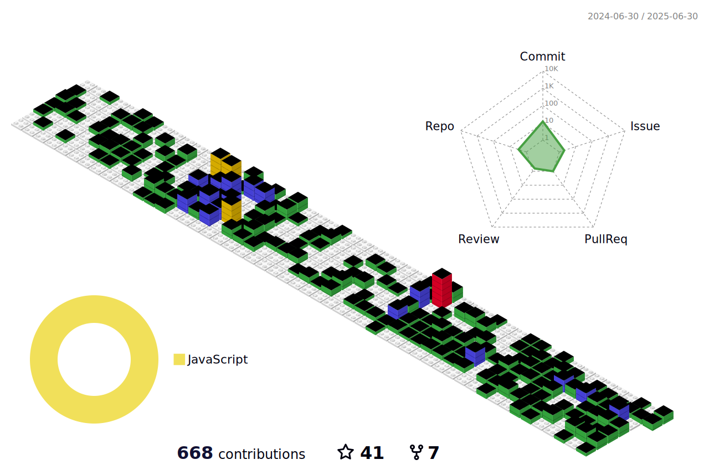

<h1 align="center">Hi 👋, I'm Mateen Shahzad</h1>
<h3 align="center">Compiling my code... Please wait! 👀</h3>
<h4 align="center">Whenever I see a door with PUSH sign, I PULL it first to avoid any conflicts.  
Don’t worry if you didn’t GIT it.
</h4>
<!--  -->

  

  

- 🔭 I’m currently working on Fatify.js, Nest.js, TypeScript, Python, Prisma ORM and AI Projects.

- 👨‍💻 All of my projects are available at [https://codebymateen.github.io](https://codebymateen.github.io)

- 👯 I am looking to collaborate on Backend Development, AI/ML and Data Engineering Projects.

- 🥅 2025 Goals: Contribute to open source, learn and explore new technologies and working on amazing software projects.

- 📢 I Love to learn new technologies and keep myself updated with latest technology trends.

- 📫 How to reach me **mateenshahzad777@gmail.com**

- ⚡ Fun fact **I think I am funny 😁**

### Consistency is the silent force behind greatness, discipline the armor that defends your purpose, and continuous practice the blade that sharpens your edge — but without slaying procrastination, even the strongest warrior falls before the battle begins.

## Connect with me

## Languages, Tools & Frameworks 

<table>
  <tr>
    <th align="left">Cloud Services</th>
    <td align="center">
      

        
        
        
      

    </td>
  </tr>
  <tr>
    <th align="left">Programming Languages</th>
    <td align="center">
      

        
        
        
        
        
        
        
        
        
      

    </td>
  </tr>
  <tr>
    <th align="left">Frameworks & Runtimes</th>
    <td align="center">
      

        
        
        
        
        
        
        
      

    </td>
  </tr>
  <tr>
    <th align="left">Databases</th>
    <td align="center">
      

        
        
        
        
        
        
        
      

    </td>
  </tr>
  <tr>
    <th align="left">DevOps & Tools</th>
    <td align="center">
      

        
        
        
        
        
        
      

    </td>
  </tr>
  <tr>
    <th align="left">Testing & Automation</th>
    <td align="center">
      

        
        
        
      

    </td>
  </tr>
  <tr>
    <th align="left">Design & UI</th>
    <td align="center">
      

        
      

    </td>
  </tr>
  <tr>
    <th align="left">Data Science / ML</th>
    <td align="center">
      

        
        
        
        
        
        
      

    </td>
  </tr>
  <tr>
    <th align="left">Message Brokers / Others</th>
    <td align="center">
      

        
        
        
      

    </td>
  </tr>
</table>

## Github Analytics

	
	
	

## GitHub Trophies 🏆

## Random Dev Quote ✍

## Contribution Graph

